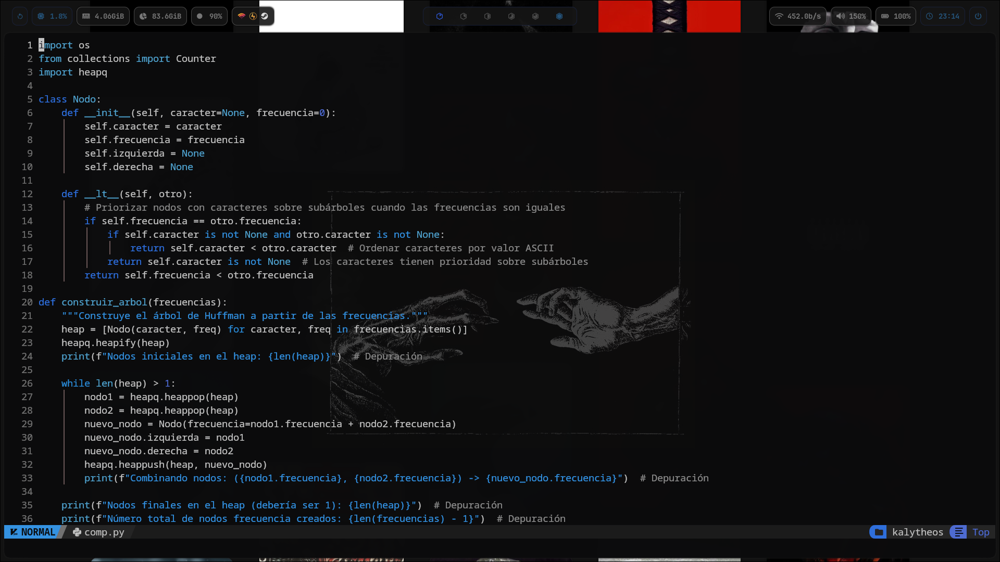
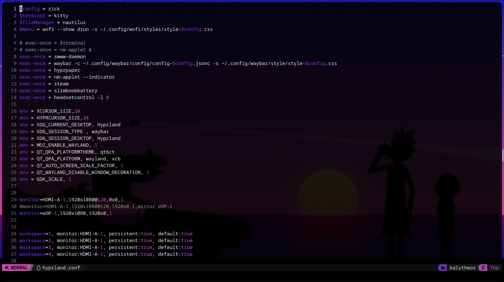
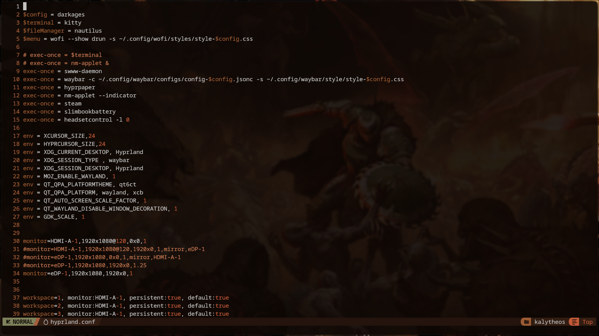

# MyDots - Hyprland Configuration

A complete Hyprland desktop environment configuration with carefully crafted dotfiles for a modern and aesthetic Linux experience.

## 🖥️ Default Desktop Preview


This is how my desktop looks by default. The wallpapers used in this setup can be found in my [Wallpin repository](https://github.com/Kalytheos/Wallpin). The status bar configuration is achieved using the files in the `waybar/` directory.

## 📁 Repository Structure

```
MyDots/
├── hyprland.conf          # Main Hyprland configuration
├── assets/               # Screenshots and preview images
├── neofetch/            # Neofetch configuration and themes
├── nvim/                # Neovim configuration with dynamic Pywal theming
├── terminal/            # Terminal configurations (Kitty, Bash, Starship)
├── waybar/              # Waybar status bar configuration
└── wofi/                # Wofi launcher configuration
```

## 🎯 Features

- **Hyprland**: Modern Wayland compositor with smooth animations
- **Waybar**: Highly customizable status bar
- **Kitty**: GPU-accelerated terminal emulator
- **Wofi**: Application launcher with custom styling
- **Neofetch**: System information tool with custom themes
- **Neovim**: Advanced text editor with dynamic Pywal color theming
- **Starship**: Cross-shell prompt with custom configuration
- **Pywal**: Color scheme generator integration

## 📸 Configuration Previews

### Terminal Setup


The terminal setup includes configurations for:
- **Kitty terminal**: GPU-accelerated terminal with custom configuration found in `terminal/kitty.conf`. Includes 42 background images located in `terminal/fkitty/` directory for a personalized terminal experience. Random background selection is configured through the bash configuration
- **Bash**: Custom bashrc in `terminal/bashrc` - includes Kitty random background image functionality
- **Starship prompt**: Configuration in `terminal/starship.toml`
- **Neofetch**: Custom themes and configurations in `neofetch/`. Multiple custom images are available in `neofetch/imagesneo/` directory with automatic random selection built into the configuration

### Color Scheme Reference


The Pywal color scheme is based on this Arch Linux themed image, which generates the dynamic color palette used throughout the configuration.

### Neovim Dynamic Theming




The Neovim configuration in `nvim/` features dynamic color theming that automatically adapts to the Pywal color scheme. This integration is powered by my [Hyprstyles](https://github.com/Kalytheos/Hyprstyles) project, which provides seamless color synchronization between Pywal and Neovim themes. The colors change dynamically based on your wallpaper selection, creating a cohesive visual experience across your entire desktop environment.

### Application Launcher


The Wofi launcher configuration is located in the `wofi/` directory. Icons used in this setup can be downloaded from [Gnome-Look](https://www.gnome-look.org/p/2128085).

## 🚀 Installation Guide

### Prerequisites

Make sure you have the following packages installed on your Arch Linux system:

```bash
sudo pacman -S hyprland waybar kitty wofi neofetch neovim starship
```

### Step-by-Step Setup

1. **Clone the repository**
   ```bash
   git clone https://github.com/Kalytheos/MyDots.git
   cd MyDots
   ```

2. **Backup your existing configurations** (if any)
   ```bash
   mkdir -p ~/.config/backup
   cp -r ~/.config/hypr ~/.config/backup/ 2>/dev/null || true
   cp -r ~/.config/waybar ~/.config/backup/ 2>/dev/null || true
   cp -r ~/.config/kitty ~/.config/backup/ 2>/dev/null || true
   cp -r ~/.config/wofi ~/.config/backup/ 2>/dev/null || true
   cp -r ~/.config/nvim ~/.config/backup/ 2>/dev/null || true
   cp ~/.config/neofetch ~/.config/backup/ 2>/dev/null || true
   ```

3. **Copy Hyprland configuration**
   ```bash
   mkdir -p ~/.config/hypr
   cp hyprland.conf ~/.config/hypr/
   ```

4. **Setup Waybar**
   ```bash
   mkdir -p ~/.config/waybar
   cp waybar/* ~/.config/waybar/
   ```

5. **Configure Terminal**
   ```bash
   # Kitty configuration
   mkdir -p ~/.config/kitty
   cp terminal/kitty.conf ~/.config/kitty/
   cp -r terminal/fkitty ~/.config/kitty/
   
   # Starship prompt
   cp terminal/starship.toml ~/.config/
   
   # Bash configuration
   cp terminal/bashrc ~/.bashrc
   ```

6. **Setup Neofetch**
   ```bash
   mkdir -p ~/.config/neofetch
   cp neofetch/config.conf ~/.config/neofetch/
   cp -r neofetch/imagesneo ~/.config/neofetch/
   ```

7. **Configure Neovim with dynamic theming**
   ```bash
   mkdir -p ~/.config/nvim
   cp -r nvim/* ~/.config/nvim/
   ```

8. **Configure Wofi**
   ```bash
   mkdir -p ~/.config/wofi
   cp wofi/* ~/.config/wofi/
   ```

9. **Download wallpapers** (optional)
   ```bash
   git clone https://github.com/Kalytheos/Wallpin.git ~/Pictures/Wallpapers
   ```

10. **Download Wofi icons** (optional)
    Download icons from [Gnome-Look](https://www.gnome-look.org/p/2128085) and place them in your preferred icons directory.

### Post-Installation

1. **Reload your shell** to apply bash and starship configurations:
   ```bash
   source ~/.bashrc
   ```

2. **Start Hyprland** (if not already running):
   ```bash
   Hyprland
   ```

3. **Customize as needed**: Feel free to modify any configuration files to match your preferences.

## 🎨 Customization

### Color Schemes
The configuration includes Pywal integration for dynamic color schemes. The color scheme file can be found at `terminal/Pywal_color_scheme.json`.

### Waybar Modules
Waybar configuration includes custom modules that can be modified in `waybar/config`. Styling can be adjusted in `waybar/style.css`.

### Neofetch Themes
Multiple neofetch image options are available in `neofetch/imagesneo/`. You can change the displayed image by modifying the `neofetch/config.conf` file.

## 🤝 Contributing

Feel free to fork this repository and submit pull requests for improvements or additional features.

## 📄 License

This configuration is provided as-is for educational and personal use.

## 🔗 Related Repositories

- [Wallpin](https://github.com/Kalytheos/Wallpin) - Wallpaper collection
- [Hyprstyles](https://github.com/Kalytheos/Hyprstyles) - Neovim dynamic theming with Pywal integration
- [Wofi Icons](https://www.gnome-look.org/p/2128085) - Icon pack for Wofi launcher

---

⭐ If you found this configuration helpful, please consider giving it a star!